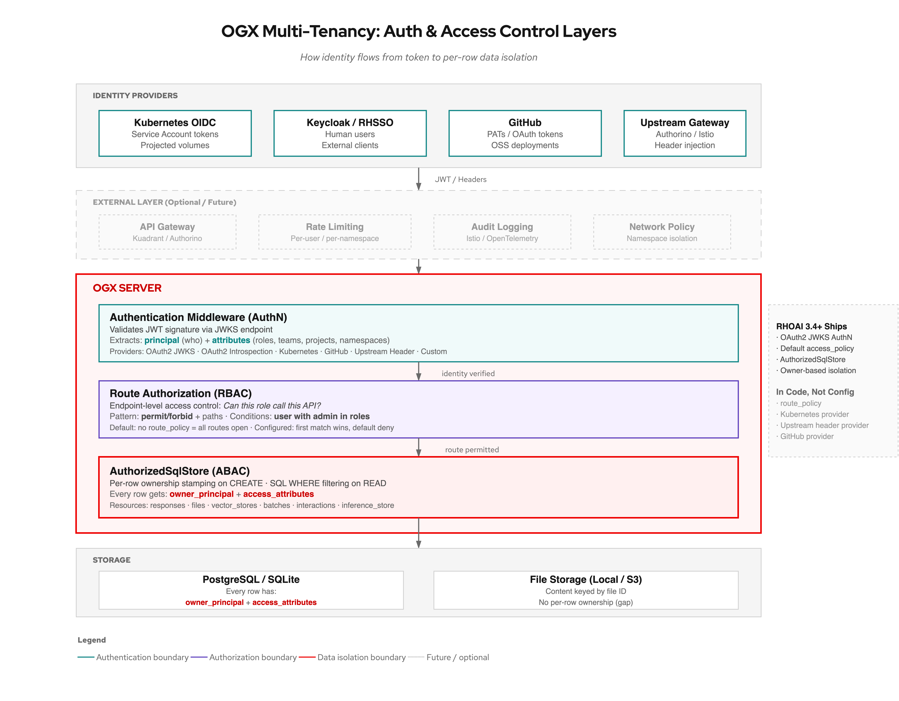
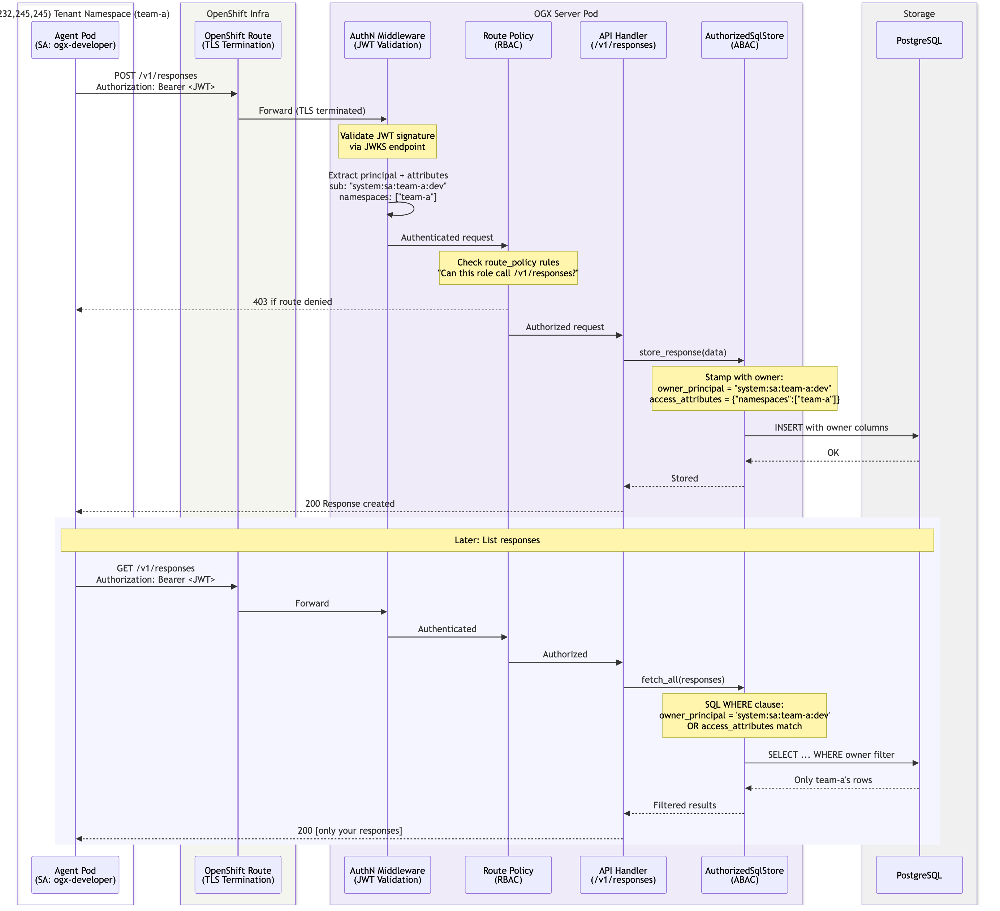
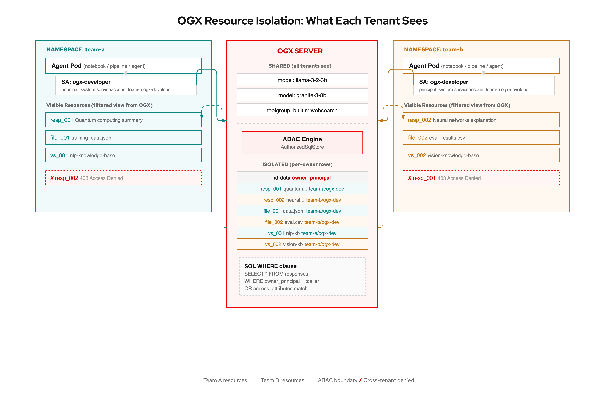
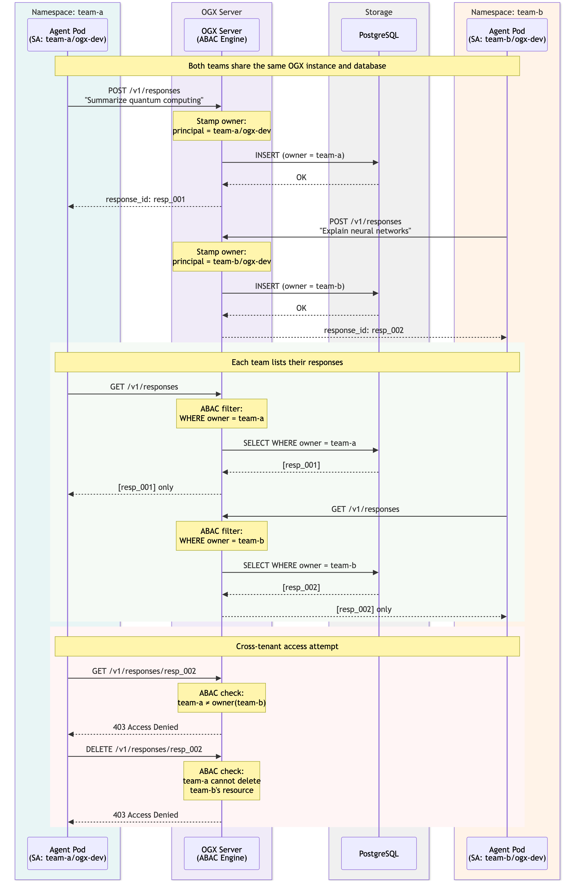

# OGX Multi-Tenancy Guide

*How to run a single OGX server for multiple teams and users without data leaking between them.*

## The Problem

A platform team deploys OGX on OpenShift to serve data scientists, application developers, and AI agents across the organization. Without multi-tenancy controls:

- **User A can see User B's stored responses.** The `/v1/responses` endpoint returns everything in the database, regardless of who created it.
- **User A can read User B's uploaded files.** The `/v1/files` endpoint has no ownership concept.
- **User A can delete User B's vector stores.** Any authenticated (or unauthenticated) caller has full CRUD access to all resources.
- **No way to restrict which models a team can use.** Every caller sees every registered model.
- **No quotas or rate limits.** One runaway agent can consume all inference capacity.

The alternative (one OGX instance per team) works but wastes resources: each instance needs its own database, model registrations, and operational overhead. Multi-tenancy lets you share infrastructure while isolating data.

## Concepts

### Authentication (AuthN) vs Authorization (AuthZ)

```
Client sends request with Bearer token
       │
       ▼
┌─────────────────────────┐
│  AUTHENTICATION (AuthN) │  "Who are you?"
│                         │
│  Validates the JWT      │  Extracts: principal, attributes
│  against JWKS/OIDC      │  (roles, teams, projects, namespaces)
└────────────┬────────────┘
             │ authenticated identity
             ▼
┌─────────────────────────┐
│  AUTHORIZATION (AuthZ)  │  "What can you do?"
│                         │
│  Two layers:            │
│  1. Route policy (RBAC) │  Can you call this endpoint?
│  2. Access policy (ABAC)│  Can you see this resource?
└─────────────────────────┘
```

### RBAC vs ABAC

| Property | RBAC (Route Policy) | ABAC (Access Policy) |
|----------|--------------------|--------------------|
| Granularity | Endpoint-level | Resource-level |
| Question answered | "Can this role call `/v1/responses`?" | "Can this user see *this specific* response?" |
| Configured via | `route_policy` in auth config | `access_policy` in auth config |
| Evaluated by | `RouteAuthorizationMiddleware` | `AuthorizedSqlStore` + `is_action_allowed()` |
| Default behavior | Allow all routes (no policy = open) | Owner-based isolation (default policy) |

### The Four Attribute Categories

OGX's ABAC system recognizes four attribute categories. These are extracted from JWT claims via `claims_mapping` and stored alongside every resource:

| Category | Typical source | Use case |
|----------|---------------|----------|
| `roles` | JWT `sub`, `username`, k8s `groups` | Role-based conditions ("user with admin in roles") |
| `teams` | JWT `groups`, `team` | Team-based sharing ("user in owners teams") |
| `projects` | JWT `project` | Project-scoped isolation |
| `namespaces` | JWT `tenant`, `namespace` | Namespace/tenant isolation |

### How Resources Get Owners

When a user creates a resource (response, file, vector store), OGX's `AuthorizedSqlStore` automatically stamps it:

```python
# What happens inside AuthorizedSqlStore.insert():
enhanced["owner_principal"] = current_user.principal    # e.g., "system:serviceaccount:team-a:ogx-dev"
enhanced["access_attributes"] = current_user.attributes # e.g., {"namespaces": ["team-a"]}
```

On read, the store filters results to only return resources the caller owns or has matching attributes for.

### How the Token Becomes Identity

The `claims_mapping` in the auth config controls which JWT claims map to which ABAC attribute categories. This is configured in the OGX server's `config.yaml` under `auth.provider_config`:

```yaml
auth:
  provider_config:
    type: oauth2_token
    audience: ogx
    issuer: https://kubernetes.default.svc
    jwks:
      uri: https://api.cluster.example.com/.well-known/jwks
    claims_mapping:
      sub: roles           # JWT "sub" claim → roles attribute
      username: roles      # JWT "username" claim → roles attribute
      groups: teams        # JWT "groups" claim → teams attribute
      tenant: namespaces   # JWT "tenant" claim → namespaces attribute
      namespace: namespaces # JWT "namespace" claim → namespaces attribute
```

**Example: Kubernetes Service Account token**

An end user (data scientist, agent developer) or their pod obtains a token for their service account. The platform admin has already created the SA and namespace (see Persona 1, Step 5). When the user runs `oc create token ogx-developer -n team-nlp --audience ogx`, the JWT payload contains:

```json
{
  "aud": ["ogx"],
  "iss": "https://kubernetes.default.svc",
  "sub": "system:serviceaccount:team-nlp:ogx-developer",
  "kubernetes.io": {
    "namespace": "team-nlp",
    "serviceaccount": { "name": "ogx-developer" }
  }
}
```

The AuthN middleware validates the signature, then extracts via `claims_mapping`:

```
principal  = "system:serviceaccount:team-nlp:ogx-developer"   (from "sub")
attributes = {
  "roles": ["system:serviceaccount:team-nlp:ogx-developer"]   (sub → roles)
}
```

**Example: Keycloak token**

A Keycloak-issued JWT carries richer claims:

```json
{
  "sub": "alice",
  "preferred_username": "alice",
  "realm_access": { "roles": ["developer", "ml-team"] },
  "groups": ["nlp-team", "research"],
  "tenant_id": "acme-corp"
}
```

With a Keycloak-specific `claims_mapping`:

```yaml
claims_mapping:
  sub: roles
  realm_access.roles: roles    # dot notation traverses nested claims
  groups: teams
  tenant_id: namespaces
```

This extracts:

```
principal  = "alice"
attributes = {
  "roles": ["alice", "developer", "ml-team"],
  "teams": ["nlp-team", "research"],
  "namespaces": ["acme-corp"]
}
```

Every resource this user creates is stamped with that principal and those attributes. On subsequent reads, the SQL WHERE clause filters to match.

## Architecture

### Auth Layers (draw.io)




### Request Flow (sequence)



### Tenant Isolation: What Each Tenant Sees (draw.io)




### Tenant Isolation: Step-by-Step (sequence)



## Resource Isolation Matrix

Which OGX resources are ABAC-isolated and which are shared across tenants:

| Resource | API | Isolated? | Storage | Notes |
|----------|-----|-----------|---------|-------|
| **Responses** | `/v1/responses` | Yes | `AuthorizedSqlStore` | Each user only sees responses they created |
| **Files** | `/v1/files` | Yes | `AuthorizedSqlStore` | File metadata is owner-scoped; file content is in local/S3 storage keyed by ID |
| **Vector Stores** | `/v1/vector_stores` | Yes | `AuthorizedSqlStore` | Store metadata and file associations are owner-scoped |
| **Batches** | `/v1/batches` | Yes | `AuthorizedSqlStore` | Batch jobs are owner-scoped |
| **Interactions** | Internal | Yes | `AuthorizedSqlStore` | Conversation state is owner-scoped |
| **Inference Store** | Internal | Yes | `AuthorizedSqlStore` | Cached inference results are owner-scoped |
| **Models** | `/v1/models` | Configurable | Registry (with owner) | Shared by default. Can be restricted per-team via custom `access_policy` (see below). |
| **Tool Groups** | `/v1/toolgroups` | Configurable | Registry (with owner) | Same as models: shared by default, restrictable via policy. |

**Key insight:** Data resources (responses, files, vector stores, batches) are fully isolated. Infrastructure resources (models, tool groups) are shared. This matches the typical deployment pattern: platform admin registers models, users consume them.

### Cross-Tenant Isolation Guarantee

When authentication is enabled, **tenants cannot see, modify, or delete each other's resources.** This is enforced at the database layer, not just the API layer:

- **LIST operations** return only the caller's own resources. Team A calling `GET /v1/responses` gets an empty list even if Team B has 1,000 stored responses.
- **GET by ID** returns 403 (or behaves as if the resource does not exist) if the caller is not the owner.
- **UPDATE and DELETE** are checked before execution. Attempting to delete another tenant's file raises `AccessDeniedError` and the operation is aborted, no data is modified.
- **CREATE** automatically stamps the new resource with the caller's identity. There is no way to create a resource "as" another user.

This isolation is implemented via `AuthorizedSqlStore`, which wraps every SQL query with a WHERE clause filtering by `owner_principal` and `access_attributes`. The filtering happens in the database query itself, not in application code after fetching all rows, so there is no window where one tenant's data is loaded into memory for another tenant's request.

**What this means in practice:**

```
Team A (token: team-a/ogx-dev)          Team B (token: team-b/ogx-dev)
─────────────────────────────           ─────────────────────────────
POST /v1/responses → resp_001           POST /v1/responses → resp_002
POST /v1/files     → file_001           POST /v1/files     → file_002

GET /v1/responses  → [resp_001]         GET /v1/responses  → [resp_002]
GET /v1/files      → [file_001]         GET /v1/files      → [file_002]

GET /v1/responses/resp_002 → 403        GET /v1/responses/resp_001 → 403
DELETE /v1/files/file_002  → 403        DELETE /v1/files/file_001  → 403

GET /v1/models → [llama, granite]       GET /v1/models → [llama, granite]
                 (shared, both see all models)
```

## Persona 1: Platform Admin

*"I need to set up OGX so multiple teams can share it safely."*

### Step 1: Deploy OGX with the Operator

The `ogx-k8s-operator` manages OGX server instances via the `OGXServer` CRD. Install RHOAI (which includes the operator), then create an OGXServer CR.

The operator handles:
- Pod deployment and lifecycle
- TLS termination (via `spec.network.tls`)
- Route/Ingress creation (via `spec.network.externalAccess`)
- NetworkPolicy (via `spec.network.policy`)
- CA bundle management (via `spec.tls.trust`)
- Service account creation

### Step 2: Enable Authentication

Auth is conditionally activated by environment variables. When `AUTH_ISSUER` is set, the OAuth2 provider activates. When it is empty, auth is disabled entirely.

**Option A: Kubernetes OIDC (recommended for in-cluster workloads)**

```bash
# Get the cluster's OIDC endpoints
AUTH_ISSUER=$(oc get --raw /.well-known/openid-configuration | jq .issuer -r)
AUTH_JWKS_URI=$(oc get --raw /.well-known/openid-configuration | jq .jwks_uri -r)

# Set these on the OGX server pod (via operator CR or env patch)
AUTH_ISSUER=<value>
AUTH_JWKS_URI=<value>
AUTH_AUDIENCE=ogx
AUTH_VERIFY_TLS=true
```

The default distro config activates when these are set:

```yaml
auth:
  provider_config:
    type: ${env.AUTH_ISSUER:+oauth2_token}   # activates only when AUTH_ISSUER is set
    audience: ${env.AUTH_AUDIENCE:=ogx}
    issuer: ${env.AUTH_ISSUER:=}
    jwks:
      uri: ${env.AUTH_JWKS_URI:=}
    verify_tls: ${env.AUTH_VERIFY_TLS:=true}
```

**Option B: External IdP (Keycloak/RHSSO) for human users and external clients**

```yaml
auth:
  provider_config:
    type: oauth2_token
    audience: ogx
    issuer: https://keycloak.example.com/realms/ai-platform
    jwks:
      uri: https://keycloak.example.com/realms/ai-platform/protocol/openid-connect/certs
    verify_tls: true
    claims_mapping:
      realm_access.roles: roles
      groups: teams
      tenant_id: namespaces
```

**Option C: Upstream gateway headers (Authorino/Istio handles auth externally)**

```yaml
auth:
  provider_config:
    type: upstream_header
    principal_header: x-auth-user-id
    attributes_header: x-auth-attributes
    attribute_headers:
      X-MaaS-Group: teams
      X-MaaS-Subscription: namespaces
```

### Step 3: Configure Access Policy

The default access policy shipped in RHOAI provides owner-based isolation:

```yaml
auth:
  access_policy:
    # System resources (models, unowned items) are readable by all
    - permit:
        actions: [read]
      when: resource is unowned
      description: "All users can read system resources"

    # Any authenticated user can create resources
    - permit:
        actions: [create]
      description: "Authenticated users can create resources"

    # Only the owner can read, update, or delete their resources
    - permit:
        actions: [read, update, delete]
      when: user is owner
      description: "Owners can manage their own resources"
```

For **team-based sharing** (users on the same team can see each other's resources):

```yaml
auth:
  access_policy:
    - permit:
        actions: [read]
      when: resource is unowned
      description: "All users can read system resources"
    - permit:
        actions: [create]
      description: "Authenticated users can create resources"
    - permit:
        actions: [read, update, delete]
      when: user is owner
      description: "Owners can manage their own resources"
    - permit:
        actions: [read]
      when: user in owners teams
      description: "Team members can read each others resources"
```

For **admin overrides** (admins can access everything):

```yaml
auth:
  access_policy:
    # Admin bypass: full access to all resources
    - permit:
        actions: [create, read, update, delete]
      when: user with admin in roles
      description: "Admins have full access"

    # Standard user policies below...
    - permit:
        actions: [read]
      when: resource is unowned
    - permit:
        actions: [create]
    - permit:
        actions: [read, update, delete]
      when: user is owner
```

### Step 4: Configure Route Policy (optional, advanced)

Route policy adds endpoint-level RBAC on top of resource-level ABAC:

```yaml
auth:
  route_policy:
    # Admins can access all routes
    - permit:
        paths: "*"
      when: user with admin in roles
      description: "Admins have full API access"

    # Regular users can only use inference and responses
    - permit:
        paths:
          - "/v1/chat/completions"
          - "/v1/responses*"
          - "/v1/models"
          - "/v1/files*"
          - "/v1/vector_stores*"
      when: user with user in roles
      description: "Users can use inference, responses, files, and vector stores"

    # Block everything else by default (no matching rule = deny)
```

### Step 5: Create Tenant Namespaces and Service Accounts

```bash
# Create a namespace per team
oc new-project team-nlp
oc new-project team-vision

# Create service accounts per role within each team
oc create serviceaccount ogx-developer -n team-nlp
oc create serviceaccount ogx-agent -n team-nlp
oc create serviceaccount ogx-pipeline -n team-nlp

oc create serviceaccount ogx-developer -n team-vision
oc create serviceaccount ogx-agent -n team-vision
```

### Step 6: Network Isolation (via operator)

The operator creates a `NetworkPolicy` by default. Customize it to restrict which namespaces can reach OGX:

```yaml
apiVersion: ogx.io/v1beta1
kind: OGXServer
metadata:
  name: ogx-distribution
  namespace: redhat-ods-applications
spec:
  network:
    policy:
      enabled: true
      ingress:
        - from:
            - namespaceSelector:
                matchLabels:
                  ogx-access: "true"
          ports:
            - port: 8321
              protocol: TCP
```

Then label allowed namespaces:

```bash
oc label namespace team-nlp ogx-access=true
oc label namespace team-vision ogx-access=true
```

## Persona 2: End User (Data Scientist / Agent Developer)

*"I want to use OGX without seeing or affecting other teams' data."*

### Getting Your Credentials

Your platform admin provides you with two things:

1. **OGX endpoint URL** (e.g., `https://ogx.apps.cluster.example.com/v1`)
2. **API key / token** obtained one of these ways:

| How you get your token | Who sets it up | User experience |
|----------------------|---------------|-----------------|
| **Environment variable** in your notebook/workspace | Platform admin pre-configures | `OGX_API_KEY` is already set when you open your notebook |
| **Keycloak login** | Platform admin provides client ID + realm URL | You log in once, SDK handles refresh |
| **API key from admin** | Admin generates and hands you a key | You paste it into your config, like any API service |

You do not need access to `oc`, `kubectl`, or any Kubernetes tooling. The OGX API is OpenAI-compatible; if you've used the OpenAI SDK, you already know how to use it.

### Using the API

```bash
# Your admin provides these (e.g., in your notebook environment)
OGX_URL="https://ogx.apps.cluster.example.com"
TOKEN="<your-api-key-from-admin>"

# List models (shared, all users see the same models)
curl -s -H "Authorization: Bearer $TOKEN" "$OGX_URL/v1/models" | python3 -m json.tool

# Create a response (automatically owned by your identity)
curl -s -H "Authorization: Bearer $TOKEN" -H "Content-Type: application/json" \
  "$OGX_URL/v1/responses" \
  -d '{"model":"vllm-inference/llama-3-2-3b","input":"Summarize quantum computing","store":true}' \
  | python3 -m json.tool

# List your responses (ABAC filters: you only see yours)
curl -s -H "Authorization: Bearer $TOKEN" "$OGX_URL/v1/responses" | python3 -m json.tool

# Upload a file (owned by you)
curl -s -H "Authorization: Bearer $TOKEN" \
  -F "file=@dataset.jsonl" -F "purpose=assistants" \
  "$OGX_URL/v1/files" | python3 -m json.tool

# Create a vector store (owned by you)
curl -s -H "Authorization: Bearer $TOKEN" -H "Content-Type: application/json" \
  "$OGX_URL/v1/vector_stores" \
  -d '{"name":"my-knowledge-base"}' | python3 -m json.tool
```

### Using the Python SDK

```python
import os
from openai import OpenAI

# Token and URL are provided by your platform admin
# (typically pre-set as environment variables in your notebook/workspace)
client = OpenAI(
    base_url=os.environ.get("OGX_URL", "https://ogx.apps.cluster.example.com/v1"),
    api_key=os.environ["OGX_API_KEY"],
)

# Create a stored response — automatically owned by your identity
response = client.responses.create(
    model="vllm-inference/llama-3-2-3b",
    input="Explain transformers",
    store=True,
)

# List responses — only returns yours, other teams' responses are invisible
my_responses = client.responses.list()
```

### How the Platform Admin Provisions Tokens (behind the scenes)

This section is for understanding only. As an end user, you don't do any of this.

OGX does not depend on Kubernetes for token generation. It accepts JWTs from any OIDC-compliant issuer. The platform admin chooses the identity provider based on their environment:

**Option A: Keycloak / RHSSO (recommended for human users)**

The admin creates users in a Keycloak realm. Users log in with username/password or SSO. No Kubernetes tooling needed.

```bash
# Admin: configure OGX to trust Keycloak
# (in config.yaml)
#   auth.provider_config.issuer: https://keycloak.example.com/realms/ai-platform
#   auth.provider_config.jwks.uri: https://keycloak.example.com/realms/ai-platform/.../certs

# User: log in and get a token (or the SDK handles this via OIDC flow)
TOKEN=$(curl -s -X POST \
  "https://keycloak.example.com/realms/ai-platform/protocol/openid-connect/token" \
  -d "grant_type=password&client_id=ogx&username=alice&password=***" \
  | jq -r .access_token)
```

**Option B: Kubernetes OIDC (convenient for in-cluster workloads)**

The admin creates service accounts. Tokens are automatically projected into pods.

```bash
# Admin creates a namespace and SA for the team
oc new-project team-nlp
oc create serviceaccount ogx-developer -n team-nlp

# For human users: admin generates a token and provides it
TOKEN=$(oc create token ogx-developer -n team-nlp --audience ogx --duration=3600s)

# For pods: token is auto-projected at /var/run/secrets/.../token
```

**Option C: Any OIDC provider (Okta, Auth0, Azure AD, Google)**

OGX's OAuth2 provider works with any issuer that exposes a JWKS endpoint. The admin configures the issuer URL and JWKS URI; users authenticate through that provider's standard flow.

**Option D: API gateway handles auth (Authorino, Istio)**

The gateway validates tokens and injects identity headers. OGX reads the headers via the `upstream_header` provider. No direct IdP integration in OGX at all.

### Multi-Tenant Walkthrough: Files and Vector Stores

Here is a complete example showing two tenants working with files and vector stores without interfering with each other:

```bash
# ── Setup: Two teams, two tokens (provided by platform admin) ──
TOKEN_A="<team-nlp-api-key>"
TOKEN_B="<team-vision-api-key>"
OGX_URL="https://ogx.apps.cluster.example.com"

# ── Team A: Upload a file ──
curl -s -H "Authorization: Bearer $TOKEN_A" \
  -F "file=@nlp-training-data.jsonl" -F "purpose=assistants" \
  "$OGX_URL/v1/files" | python3 -m json.tool
# Returns: {"id": "file_abc", "filename": "nlp-training-data.jsonl", ...}

# ── Team A: Create a vector store and attach the file ──
curl -s -H "Authorization: Bearer $TOKEN_A" -H "Content-Type: application/json" \
  "$OGX_URL/v1/vector_stores" \
  -d '{"name":"nlp-knowledge-base","file_ids":["file_abc"]}' | python3 -m json.tool
# Returns: {"id": "vs_123", "name": "nlp-knowledge-base", ...}

# ── Team B: Upload their own file ──
curl -s -H "Authorization: Bearer $TOKEN_B" \
  -F "file=@image-labels.csv" -F "purpose=assistants" \
  "$OGX_URL/v1/files" | python3 -m json.tool
# Returns: {"id": "file_xyz", "filename": "image-labels.csv", ...}

# ── Team B: Create their own vector store ──
curl -s -H "Authorization: Bearer $TOKEN_B" -H "Content-Type: application/json" \
  "$OGX_URL/v1/vector_stores" \
  -d '{"name":"vision-embeddings","file_ids":["file_xyz"]}' | python3 -m json.tool
# Returns: {"id": "vs_456", "name": "vision-embeddings", ...}

# ── Each team only sees their own resources ──

# Team A lists files → only their file
curl -s -H "Authorization: Bearer $TOKEN_A" "$OGX_URL/v1/files" | python3 -m json.tool
# Returns: [{"id": "file_abc", "filename": "nlp-training-data.jsonl"}]

# Team B lists files → only their file
curl -s -H "Authorization: Bearer $TOKEN_B" "$OGX_URL/v1/files" | python3 -m json.tool
# Returns: [{"id": "file_xyz", "filename": "image-labels.csv"}]

# Team A lists vector stores → only their store
curl -s -H "Authorization: Bearer $TOKEN_A" "$OGX_URL/v1/vector_stores" | python3 -m json.tool
# Returns: [{"id": "vs_123", "name": "nlp-knowledge-base"}]

# Team B lists vector stores → only their store
curl -s -H "Authorization: Bearer $TOKEN_B" "$OGX_URL/v1/vector_stores" | python3 -m json.tool
# Returns: [{"id": "vs_456", "name": "vision-embeddings"}]

# ── Cross-tenant access: blocked ──

# Team A tries to read Team B's file → denied
curl -s -H "Authorization: Bearer $TOKEN_A" "$OGX_URL/v1/files/file_xyz"
# Returns: 403 {"error": "Access denied"}

# Team A tries to search Team B's vector store → denied
curl -s -H "Authorization: Bearer $TOKEN_A" -H "Content-Type: application/json" \
  "$OGX_URL/v1/vector_stores/vs_456/search" \
  -d '{"query":"image classification"}' 
# Returns: 403 {"error": "Access denied"}

# Team B tries to delete Team A's vector store → denied
curl -s -X DELETE -H "Authorization: Bearer $TOKEN_B" "$OGX_URL/v1/vector_stores/vs_123"
# Returns: 403 {"error": "Access denied"}
```

### What You Can and Cannot Do

| Action | Result |
|--------|--------|
| List models | See all models (shared) |
| Create a response with `store=true` | Response is stamped with your identity |
| List responses | Only your responses appear |
| Read another user's response by ID | 403 or empty (filtered out by ABAC) |
| Upload a file | File is stamped with your identity |
| List files | Only your files appear |
| Delete someone else's file | 403 Access Denied |
| Create a vector store | Store is stamped with your identity |
| Search another user's vector store | 403 Access Denied |

## Auth Provider Comparison

| Provider | Token source | Best for | Limitations |
|----------|-------------|----------|-------------|
| **OAuth2 (JWKS)** | JWT validated via JWKS endpoint | K8s OIDC, Keycloak, any OIDC provider | Requires JWKS endpoint reachability |
| **OAuth2 (Introspection)** | Token validated via RFC 7662 endpoint | Opaque tokens, legacy OAuth servers | Extra network call per request |
| **Kubernetes** | Token validated via K8s SelfSubjectReview API | In-cluster SAs, simple setup | K8s API server dependency per request |
| **GitHub** | GitHub PAT validated via GitHub API | Open-source deployments, GitHub-centric orgs | GitHub API rate limits |
| **Upstream Header** | Gateway injects identity headers | Authorino, Istio, API gateways | Must trust the network path completely |
| **Custom** | Token sent to custom HTTP endpoint | Proprietary auth systems | Must build and maintain the endpoint |

### When to Use Which

```
Where are your users?
  │
  ├─ In-cluster machines only (agents, pipelines)
  │    → OAuth2 with Kubernetes OIDC (simplest, no external IdP)
  │
  ├─ In-cluster machines + internal humans (notebooks)
  │    → OAuth2 with Kubernetes OIDC for machines
  │    + Keycloak/RHSSO for humans (same OGX instance, different token issuers)
  │
  ├─ External users or partners
  │    → Keycloak/RHSSO with OAuth2 JWKS
  │
  └─ Behind an API gateway (Kuadrant, Authorino, Istio)
       → Upstream Header provider (gateway handles auth, OGX trusts headers)
```

## How the Operator Factors In

The `ogx-k8s-operator` manages OGX deployments via the `OGXServer` CRD. Here is what it handles and what it does not:

### What the operator manages

| Concern | How |
|---------|-----|
| **Pod lifecycle** | Deploys and reconciles the OGX server pod |
| **TLS termination** | `spec.network.tls.secretName` references a TLS Secret |
| **External access** | `spec.network.externalAccess` creates Route or Ingress |
| **Network policy** | `spec.network.policy` creates K8s NetworkPolicy with configurable ingress/egress rules |
| **CA bundles** | `spec.tls.trust.caCertificates` aggregates CA certs into a managed ConfigMap, sets `SSL_CERT_FILE` |
| **Client mTLS** | `spec.tls.identity` mounts client cert/key for outbound mTLS to providers |
| **Service account** | Creates a default SA; overridable via `spec.workload.overrides.serviceAccountName` |
| **Config reconciliation** | Watches ConfigMaps/Secrets with `ogx.io/watch: "true"` label for live updates |

### What the operator does NOT manage (today)

| Concern | Current state |
|---------|--------------|
| **Auth env vars** | `AUTH_ISSUER`, `AUTH_JWKS_URI`, etc. must be set manually (via env override on the CR or patching the deployment) |
| **Access policy** | Baked into the distro `config.yaml`, not exposed as a CRD field |
| **Route policy** | Not in the default config; must be added via custom config.yaml |
| **Tenant namespace creation** | Out of scope; admin creates namespaces and SAs manually |
| **IdP integration** | No CRD field for Keycloak/OIDC configuration; admin sets env vars |
| **Quota / rate limiting** | Not in scope; requires external gateway (Kuadrant) |

### Desired operator improvements

The operator could expose auth configuration as first-class CRD fields:

```yaml
# HYPOTHETICAL future OGXServer CR
apiVersion: ogx.io/v1beta1
kind: OGXServer
spec:
  auth:
    provider: oauth2_token
    issuer: https://kubernetes.default.svc
    audience: ogx
    jwks:
      uri: https://api.cluster.example.com/.well-known/jwks
    accessPolicy:
      - permit:
          actions: [read]
        when: resource is unowned
      - permit:
          actions: [create, read, update, delete]
        when: user is owner
    routePolicy:
      - permit:
          paths: "*"
        when: user with admin in roles
```

This would eliminate the need to manually patch env vars and custom config files.

## Feature Availability by Release

| Feature | RHOAI 3.3 | RHOAI 3.4 | RHOAI 3.5 EA1 | RHOAI 3.5 EA2 |
|---------|-----------|-----------|---------------|---------------|
| **Auth disabled by default** | Yes (no auth) | Yes (conditional) | Yes (conditional) | Yes (conditional) |
| **OAuth2 JWKS provider** | No | Yes | Yes | Yes |
| **Conditional activation** (`AUTH_ISSUER:+`) | No | Yes | Yes | Yes |
| **Default access_policy** (owner isolation) | No | Yes | Yes | Yes |
| **AuthorizedSqlStore** (per-row ABAC) | No | Yes | Yes | Yes |
| **Responses isolation** | No | Yes | Yes | Yes |
| **Files isolation** | No | Yes | Yes | Yes |
| **Vector store isolation** | No | Yes | Yes | Yes |
| **Batches isolation** | No | Yes | Yes | Yes |
| **Audience default** | N/A | `llama-stack` | `ogx` | `ogx` |
| **route_policy** (endpoint RBAC) | No | In code, not in config | In code, not in config | In code, not in config |
| **Kubernetes auth provider** | No | In code, not in config | In code, not in config | In code, not in config |
| **Upstream header provider** | No | No | In code, not in config | In code, not in config |
| **GitHub token provider** | No | No | In code, not in config | In code, not in config |
| **Custom policy language** (Cedar-like) | No | Yes | Yes | Yes |
| **Operator CRD auth fields** | No | No | No | No |

**"In code, not in config"** means the feature exists in the OGX codebase and can be used by supplying a custom `config.yaml`, but it is not present in the default RHOAI distribution config and has not been tested or supported as part of the product.

## What's Missing: Gap Analysis

### Gap 1: Model-Level Access Control (Supported But Undocumented)

**Status:** The code supports model-level access control via `access_policy` with `resource` patterns. The routing table enforces `is_action_allowed` on both single-model lookups and list operations. However, the default policy ships with no model restrictions, and no documentation or examples exist for configuring them.

**Default behavior:** All authenticated users see all registered models. The default policy permits reads on unowned resources, and platform-registered models are treated as unowned.

**How to restrict models per team:**

```yaml
access_policy:
  # System resources (unowned) are readable by all — REMOVE this for model restrictions
  # - permit:
  #     actions: [read]
  #   when: resource is unowned

  # Instead, be explicit about which models each team can see:

  # Team NLP can see Llama and Granite models
  - permit:
      actions: [read]
      resource: "regex:model::(vllm-inference/llama|vllm-inference/granite)-.*"
    when: user with nlp-team in teams
    description: "NLP team can access Llama and Granite models"

  # Team Vision can only see vision models
  - permit:
      actions: [read]
      resource: "model::vllm-inference/llava-*"
    when: user with vision-team in teams
    description: "Vision team can only access LLaVA models"

  # Admins see everything
  - permit:
      actions: [read]
      resource: "model::*"
    when: user with admin in roles
    description: "Admins can see all models"

  # Standard data isolation rules (unchanged)
  - permit:
      actions: [create]
    description: "Authenticated users can create resources"
  - permit:
      actions: [read, update, delete]
    when: user is owner
    description: "Owners can manage their own resources"
```

The `resource` field supports three patterns:
- Exact: `model::vllm-inference/llama-3-2-3b`
- Wildcard: `model::vllm-inference/*` (matches all models from vllm-inference provider)
- Regex: `regex:model::(llama|granite)-.*`

**What's actually missing:** The default config does not include model restriction examples, and there is no operator CRD field to configure per-team model access. Admins must hand-edit the config.yaml to add these rules.

### Gap 2: No Rate Limiting or Quotas

**Problem:** One tenant's batch job can consume all inference capacity. No per-user or per-namespace throttling exists.

**Impact:** Noisy neighbor problem in shared deployments.

**Possible solutions:**
- Kuadrant RateLimitPolicy on the OGX Route (per-user, per-namespace)
- K8s ResourceQuota on the inference backend (vLLM) namespace
- OGX-level quota middleware (does not exist today)

### Gap 3: No Audit Logging

**Problem:** OGX logs requests but does not emit structured audit events tied to identity. No record of "user X deleted vector store Y at time Z."

**Impact:** Compliance requirements (SOC2, FedRAMP) typically require identity-tagged audit trails for data access.

**Possible solutions:**
- Structured audit log middleware in OGX that emits events to stdout/OpenTelemetry
- Sidecar proxy (Istio) with access logging enabled
- OpenShift audit logging at the Route level

### Gap 4: No Admin Role in ABAC

**Problem:** There is no built-in concept of "admin" vs "user." The `user with admin in roles` condition works, but nothing in the default config creates admin roles. The platform admin must manually configure claims_mapping to extract an admin role from JWT claims.

**Impact:** Platform admins cannot debug or manage user resources without adopting the user's identity.

**Possible solution:** A well-documented admin policy pattern in the default config, activated when a specific claim is present.

### Gap 5: Operator Does Not Expose Auth Config

**Problem:** The `OGXServer` CRD has no fields for authentication configuration. Admins must patch environment variables or provide a custom config.yaml. This is error-prone and not discoverable.

**Impact:** Multi-tenancy setup requires tribal knowledge. New platform admins may not know which env vars to set.

**Possible solution:** Add `spec.auth` to the OGXServer CRD with fields for provider type, issuer, JWKS URI, audience, access_policy, and route_policy. The operator would template these into the server config.

### Gap 6: No Cross-Cluster Federation

**Problem:** SA tokens are scoped to the issuing cluster. Users in Cluster A cannot authenticate to OGX in Cluster B without an external IdP.

**Impact:** Multi-cluster deployments require Keycloak or another federation layer.

**Possible solution:** Document the Keycloak federation pattern. The OGX auth layer already supports any OIDC issuer, so this is a deployment pattern gap, not a code gap.

### Gap 7: Token Refresh for Long-Running Workloads

**Problem:** SA tokens issued via `oc create token` are static for their duration. No refresh token flow. Notebooks and long-running agents need either very long durations (security risk) or manual re-creation.

**Impact:** UX friction for data scientists in notebooks.

**Possible solution:** Use projected service account volumes (auto-rotated by kubelet) instead of manually-created tokens. Document this pattern.

### Gap 8: File Content Isolation at Storage Level

**Problem:** File metadata is ABAC-isolated (User A cannot list User B's files). But the actual file content on local filesystem or S3 is keyed by file ID. If a user guesses or discovers a file ID, they could potentially access the raw content directly at the storage layer (bypassing the API).

**Impact:** Defense-in-depth concern. The API layer protects access, but the storage layer does not double-check ownership.

**Possible solution:** Namespace file storage paths by owner principal (e.g., `{owner_hash}/{file_id}`). Or encrypt file content with per-owner keys.

## Quick Reference: Condition Language

OGX's access policy uses a Cedar-inspired condition language. All supported conditions:

| Condition | Meaning |
|-----------|---------|
| `user is owner` | The user's principal matches the resource's owner principal |
| `user is not owner` | The user is NOT the owner |
| `resource is unowned` | The resource has no owner (system resource) |
| `user with <value> in <attr>` | The user has `<value>` in their `<attr>` list (e.g., `user with admin in roles`) |
| `user with <value> not in <attr>` | The user does NOT have that value |
| `user in owners <attr>` | The user shares at least one value with the resource owner in `<attr>` (e.g., `user in owners teams`) |
| `user not in owners <attr>` | No shared values in that attribute category |

Conditions are combined with AND logic when multiple are listed. Rules are evaluated in order; first match wins.

## Summary

OGX provides a solid foundation for multi-tenancy starting in RHOAI 3.4: JWT-based authentication with conditionally-activated OAuth2, per-row ABAC via `AuthorizedSqlStore`, and a Cedar-like policy language for fine-grained access rules. All data resources (responses, files, vector stores, batches) are isolated by owner identity.

The primary gaps are in the infrastructure layer: no model-level RBAC, no rate limiting, no audit logging, and no operator-level auth configuration. These gaps can be addressed today by layering external components (Kuadrant for rate limiting, Istio for audit logging, custom config.yaml for advanced policies), but they represent friction for platform admins who expect these capabilities out of the box.

For most internal deployments where teams share a cluster, the current approach (Kubernetes OIDC + default ABAC policy + namespace-scoped SAs) is sufficient and requires minimal setup. For production multi-tenant deployments with external users, compliance requirements, or cost attribution needs, the gaps above need to be addressed.
